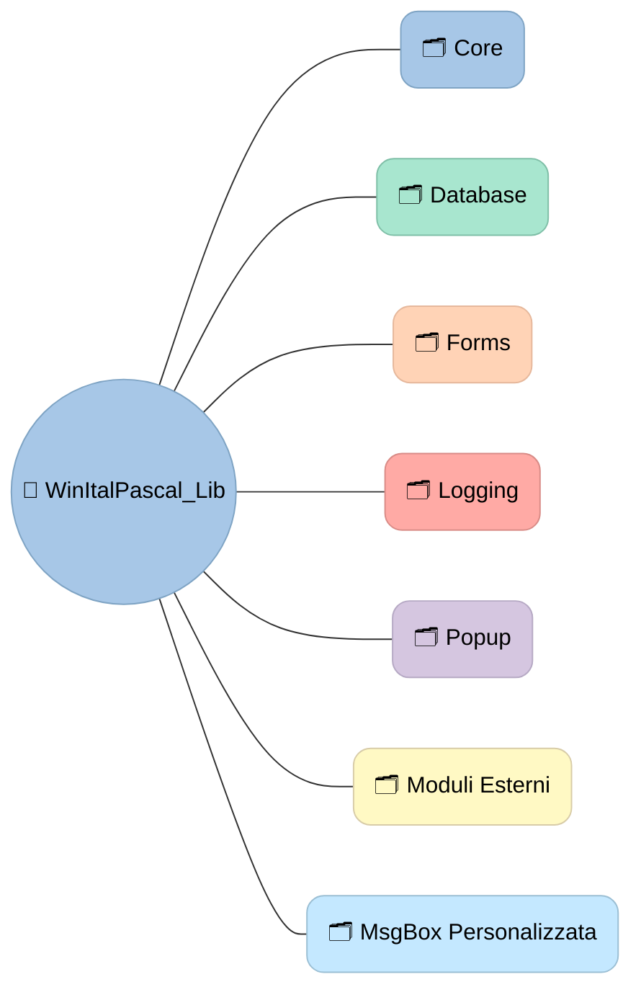

```mermaid
graph LR

    %% ====== PALETTE PASTELLO TECH (MODERNA) ======
    classDef core fill:#A7C7E7,stroke:#7FA4C4,color:#000000,rx:12,ry:12;
    classDef db fill:#A8E6CF,stroke:#7FBFA7,color:#000000,rx:12,ry:12;
    classDef forms fill:#FFD3B6,stroke:#E6B89C,color:#000000,rx:12,ry:12;
    classDef log fill:#FFAAA5,stroke:#D98C87,color:#000000,rx:12,ry:12;
    classDef popup fill:#D5C6E0,stroke:#B6A9C4,color:#000000,rx:12,ry:12;
    classDef ext fill:#FFF9C4,stroke:#D8CCA8,color:#000000,rx:12,ry:12;
    classDef msg fill:#C4E8FF,stroke:#9BBFD4,color:#000000,rx:12,ry:12;

    %% ====== NODO CENTRALE ======
    A((🧩 WinItalPascal_Lib)):::core

    %% ====== CORE ======
    A --- B(🗂️ Core):::core
    click B "https://github.com/List051/WinItalPascal_Lib/tree/main/Documentation"

    %% ====== DATABASE ======
    A --- C(🗂️ Database):::db
    click C "https://github.com/List051/WinItalPascal_Lib/tree/main/Documentation"

    %% ====== FORMS ======
    A --- D(🗂️ Forms):::forms
    click D "https://github.com/List051/WinItalPascal_Lib/tree/main/Documentation"

    %% ====== LOGGING ======
    A --- E(🗂️ Logging):::log
    click E "https://github.com/List051/WinItalPascal_Lib/tree/main/Documentation"

    %% ====== POPUP ======
    A --- F(🗂️ Popup):::popup
    click F "https://github.com/List051/WinItalPascal_Lib/tree/main/Documentation"

    %% ====== MODULI ESTERNI ======
    A --- G(🗂️ Moduli Esterni):::ext
    click G "https://github.com/List051/WinItalPascal_Lib/tree/main/Documentation"

    %% ====== MESSAGEBOX PERSONALIZZATA ======
    A --- M(🗂️ MsgBox Personalizzata):::msg
    click M "https://github.com/List051/WinItalPascal_Lib/tree/main/Documentation"
```
